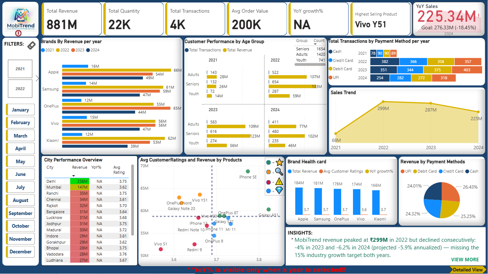
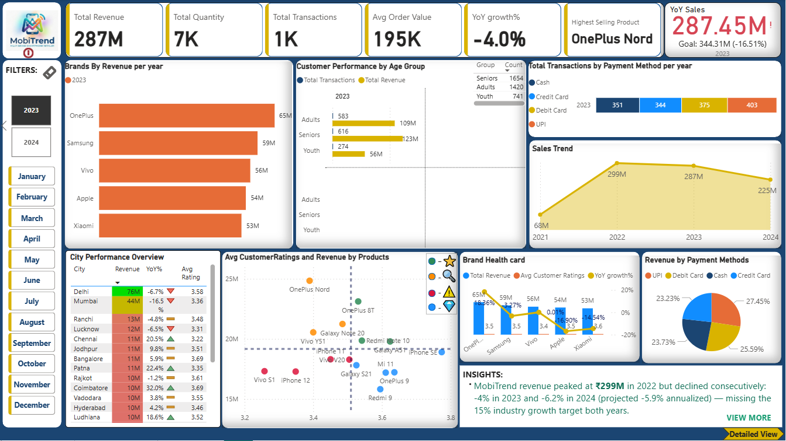
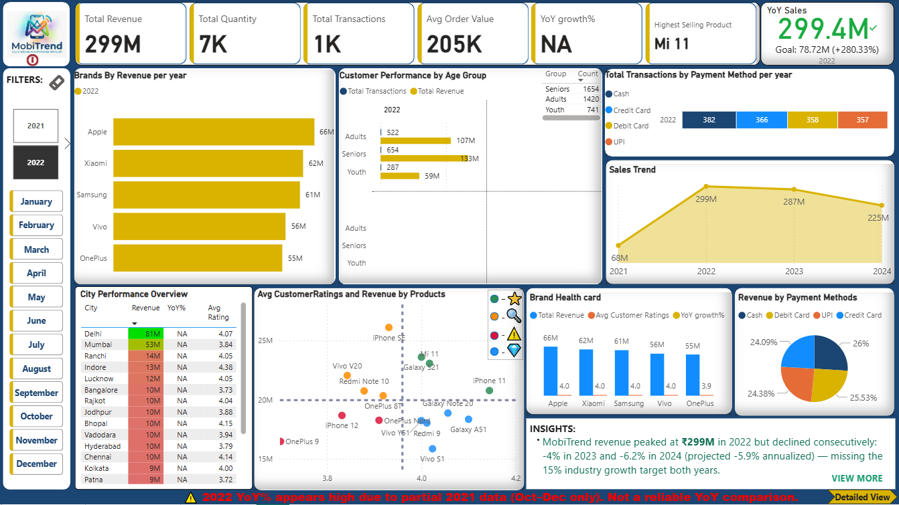
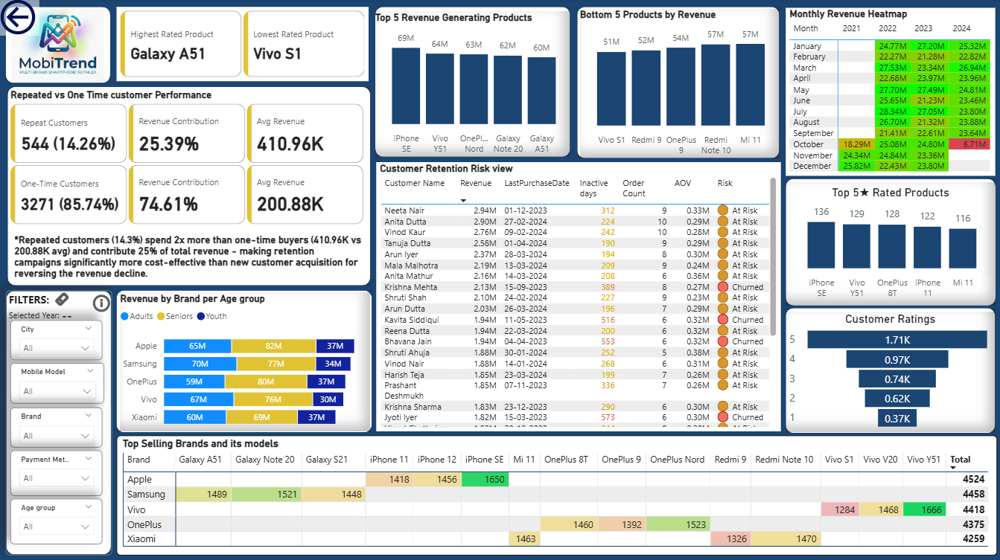
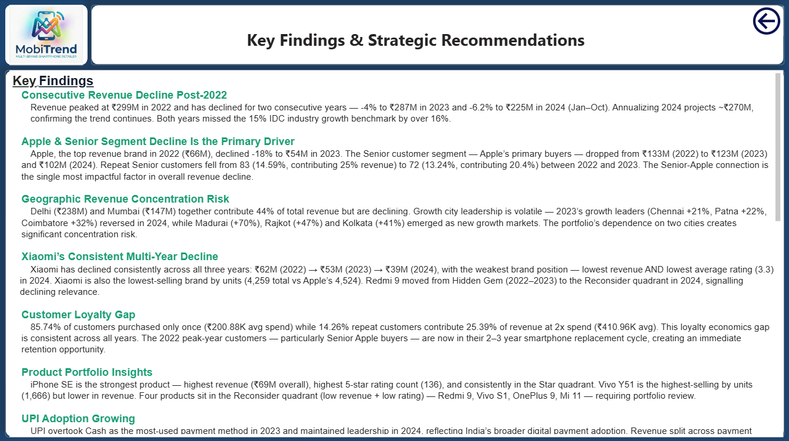

# 📱 Mobile Sales Intelligence Dashboard - PowerBI Project

## 🏢 Business Problem

**MobiTrend Retail India** — a multi-brand smartphone retailer operating across 19 Indian cities — experienced consecutive revenue declines of **-4% in 2023** and **-6.2% in 2024** after peaking at ₹299M in 2022. Leadership needed a single interactive dashboard to:

- Diagnose the root cause of the post-2022 revenue decline
- Identify which brands, models and cities are growing vs falling
- Understand customer behaviour by age group, payment preference and satisfaction
- Prioritise inventory, promotions and expansion decisions to reverse the trend

> **Target:** 15% YoY growth benchmarked against India's smartphone retail industry average (IDC, 2023)

---

## 📂 Project Structure

```
MobiTrend-Sales-Intelligence-Dashboard/
├── Data/
│   └── Mobile_Sales_Data.xlsx          # Raw data (5,200 rows)
├── Dashboard/
│   └── MobiTrend_Dashboard.pbix        # Power BI report file
├── Documentation/
│   └── Project_Notes.docx               # DAX measures + methodology
├── Screenshots/
│   ├── Dashboard_Overview.png
│   ├── Dashboard_2023.png
│   ├── Dashboard_2022.png
│   ├── Detailed_View.png
│   └── Key_Findings_Recommendations.png
└── README.md
```

---

## 📌 Data Schema

### Tables Used
- Customers(CustomerKey, Customer Name, Customer Age, City)
- Products(ProductKey, Brand, Mobile Model)
- Payments(PaymentKey, Payment Method)
- Sales(TransactionID, DateKey, CustomerKey, ProductKey, PaymentKey, Units, PricePerUnit, CustomerRatings)
- Date(DateKey, Date, Year, Month, Day, DayName)

---

## 🗃️ Data Overview

| Detail | Value |
|--------|-------|
| Raw Records | 5,200 |
| Clean Records | 4,409 |
| Period | Oct 2021 – Oct 2024 |
| Brands | Apple, Samsung, OnePlus, Vivo, Xiaomi |
| Models | 15 smartphone models |
| Cities | 19 Indian cities |
| Total Revenue (clean data) | ₹881M |

---

## 🧹 Data Cleaning (Power Query)

### Assumptions
- Units <= 0 and PricePerUnit ≤ 0 are invalid
- Customer ratings outside 1–5 clamped to boundary values (below 1 → 1, above 5 → 5) to avoid data loss
- 15% YoY target benchmarked against IDC India smartphone retail average (2023)

### ETL Steps Performed
- Validated data types across all 5 tables
- Removed duplicates/blanks
- Verified payment method values
- Removed unnecessary columns
- Filtered invalid Units (<=0) and PricePerUnit (≤0)
- Clamped customer ratings outside 1–5 to boundary values (below 1 → 1, above 5 → 5) to avoid data loss
- Removed null CustomerKey/ProductKey/PaymentKey records
- Removed invalid ProductKey (9999) identified via DAX EXCEPT
- Added Age Group column (Youth/Adults/Seniors) in Customers table
- Parsed and validated DateKey using custom M formula

### Custom Date Parsing (M Language)
```m
OrderDate = try Date.From(
    Text.Start([DateKey], 4) & "-" &
    Text.Middle([DateKey], 4, 2) & "-" &
    Text.End([DateKey], 2)
) otherwise null
```

### FK Integrity Validation (DAX)
```dax
InvalidProducts = EXCEPT(VALUES(Sales[ProductKey]), VALUES(Products[ProductKey]))
-- Returned: 9999 → filtered out in Power Query

InvalidCustomers = EXCEPT(VALUES(Sales[CustomerKey]), VALUES(Customers[CustomerKey]))
-- Returned: (blank) → no invalid customers found
```

---

## 🗄️ Data Model — Star Schema

```
DimDate ──────────┐
DimProduct ───────┤
DimCustomer ──────┼──→ FactSales (4,409 rows)
DimPayment ───────┘
```

- **Fact Table:** FactSales
- **Dimensions:** DimDate, DimProduct, DimCustomer, DimPayment
- **Relationships:** One-to-Many, Single direction filter
- **Date table** used for all time intelligence functions

---

## 📐 DAX Measures

### Core Metrics
```dax
Total Revenue = SUMX(Sales, Sales[Units] * Sales[PricePerUnit])
Total Quantity = SUM(Sales[Units])
Total Transactions = DISTINCTCOUNT(Sales[TransactionID])
Average Order Value = DIVIDE([Total Revenue], [Total Transactions], 0)
Avg Customer ratings = AVERAGE(Sales[CustomerRatings])
```

### Time Intelligence
```dax
Last Year Sales = CALCULATE([Total Revenue], SAMEPERIODLASTYEAR('Date'[Date]))
Target Sales = [Last Year Sales] * 1.15
YoY growth% = IF(
                  HASONEVALUE('Date'[Date].[Year]), 
                    IF(SELECTEDVALUE('Date'[Date].[Year]) in {2021, 2022}, "NA", DIVIDE([Total Revenue] - [lastYrSales], [lastYrSales],0)),
                    "NA"
                )
```

### Product Quadrant Classification
```dax
-- Global benchmark measures
Avg Rating = CALCULATE(AVERAGE(Sales[CustomerRatings]), ALL(Products[Mobile Model]))
Avg Revenue = AVERAGEX(ALL(Products[Mobile Model]), [Total Revenue])

-- Quadrant classification 
Quadrant Label =
VAR AvgRating = [Avg Rating]
VAR AvgRevenue = [Avg Revenue]
VAR CurrentRating = [Avg Customer ratings]
VAR CurrentRevenue = [Total Revenue]
RETURN
SWITCH(TRUE(),
    CurrentRevenue >= AvgRevenue && CurrentRating >= AvgRating,
        "⭐ Star — Protect & Invest",
    CurrentRevenue >= AvgRevenue && CurrentRating < AvgRating,
        "🔍 Investigate — High Revenue, Low Satisfaction",
    CurrentRevenue < AvgRevenue && CurrentRating >= AvgRating,
        "💎 Hidden Gem — Promote & Push Inventory",
    "⚠️ Reconsider — Low Revenue & Low Satisfaction"
)

-- Color coding per quadrant
Quadrant Color =
SWITCH([Quadrant Label],
    "⭐ Star — Protect & Invest",                         "#2E8B57",
    "🔍 Investigate — High Revenue, Low Satisfaction",    "#FF8C00",
    "💎 Hidden Gem — Promote & Push Inventory",           "#1E90FF",
    "⚠️ Reconsider — Low Revenue & Low Satisfaction",     "#DC143C",
    "#808080"
)

-- Strategic recommendation per quadrant (tooltip)
Strategic Recommendation =
SWITCH([Quadrant Label],
    "⭐ Star — Protect & Invest",
        "Maintain premium positioning, ensure inventory availability, and strengthen loyalty campaigns.",
    "🔍 Investigate — High Revenue, Low Satisfaction",
        "Analyze customer complaints, improve quality/service issues, and monitor churn risk.",
    "💎 Hidden Gem — Promote & Push Inventory",
        "Increase marketing visibility and bundle promotions to unlock growth potential.",
    "⚠️ Reconsider — Low Revenue & Low Satisfaction",
        "Review pricing, redesign strategy, or reduce inventory exposure."
)

```
This analysis supports:
- inventory optimization
- marketing prioritization
- product strategy decisions

### Customer Retention Analysis
```dax
Purchase Frequency =
CALCULATE(
    DISTINCTCOUNT(Sales[TransactionID]),
    ALLEXCEPT(Sales, Sales[CustomerKey])
)

Repeat Customers =
CALCULATE(
    DISTINCTCOUNT(Sales[CustomerKey]),
    FILTER(VALUES(Sales[CustomerKey]), [Purchase Frequency] > 1)
)

One Time Customers = DISTINCTCOUNT(Sales[CustomerKey]) - [Repeat Customers]

Repeat Customer Revenue% =
DIVIDE(
    CALCULATE([Total Revenue],
        FILTER(VALUES(Sales[CustomerKey]), [Purchase Frequency] > 1)),
    [Total Revenue], 0
)
```

### Dynamic UX Measures
```dax
-- Partial year warning (appears only when 2022 selected)
    Partial Year Warning =
                        IF(
                             HASONEVALUE('Date'[Date].[Year]),
                               IF(SELECTEDVALUE('Date'[Date].[Year])=2022,
                                 "⚠️ 2022 YoY% appears high due to partial 2021 data (Oct–Dec only). Not a reliable YoY comparison.", 
                                 " "),
                             "**YoY% is visible only when a year is selected!!"
                        )

-- Highest selling product by units
    Top Selling Product =
                    VAR TopProduct = TOPN(1, VALUES(DimProduct[Mobile Model]),
                                        CALCULATE(SUM(Sales[Units])))
                                        RETURN MAXX(TopProduct, DimProduct[Mobile Model])
```

---

## 📊 Dashboard Pages

### Page 1 — Dashboard (Executive Overview)
| Visual | Purpose |
|--------|---------|
| KPI Cards (6) | Total Revenue, Quantity, Transactions, AOV, YoY%, Highest Selling Product |
| YoY Sales KPI | Actual vs 15% Target with variance |
| Brands By Revenue Per Year | Brand × Year clustered bar — growth vs decline |
| Customer Performance by Age Group | Transactions + Revenue by age group across years |
| Sales Trend | Full 4-year trend (ignores year slicer) |
| City Performance Table | Revenue + YoY% + Avg Rating per city |
| Brand Health Card | Revenue + YoY% + Avg Rating per brand |
| Scatter Plot (Quadrant) | Products classified into 4 strategic quadrants with color + tooltip |
| Payment Method Charts | Transactions by method per year + Revenue % split |
| Insights Box | Executive summary with VIEW MORE popup |
| Dynamic Warning | 2022 partial year alert via SELECTEDVALUE |

**Special Features:**
- ⓘ Info button tooltip: partial year data disclaimer
- VIEW MORE button → Executive Summary popup with 4 key findings
- "VIEW DETAILED INSIGHTS" → navigates to Page 3
- Synced Year + Month slicers across all pages

### Page 2 — Detailed View (Analyst Deep Dive)
| Visual | Purpose |
|--------|---------|
| KPI Cards | Highest/Lowest Rated Product, Repeat/One-time metrics |
| Repeat vs One-Time Analysis | 6-card layout with insight text |
| Customer Retention Risk Table | Revenue, Last Purchase, Inactive Days, Risk Category |
| Monthly Revenue Heatmap | Heat scale by month × year |
| Top 5 / Bottom 5 Products | Revenue comparison side by side |
| Revenue by Brand per Age Group | Which age group drives which brand |
| Top 5★ Rated Products | Products with most 5-star transactions |
| Customer Ratings Distribution | 1–5 star transaction count |
| Top Selling Brands & Models Matrix | Units sold with conditional formatting |

**Special Features:**
- Granular filters: City, Brand, Mobile Model, Payment Method, Age Group
- Year/Month synced from Page 1 (hidden on Page 2)
- Back navigation button ← top left

### Page 3 — Key Findings & Strategic Recommendations
- 7 key findings with supporting data points
- 6 strategic recommendations with specific action items and expected impact
- Back navigation button ← top right
- Pure narrative for leadership consumption

---

## 💡 Key Findings

1. **Revenue declined -4% (2023) and -6.2% (2024)** after 2022 peak — missing 15% industry target both years (annualised 2024 ~₹270M confirms trend)
2. **Apple + Senior segment** is the primary decline driver — Apple fell -18% in 2023; repeat Senior customers dropped from 83 to 72, revenue contribution from 25% to 20.4%
3. **44% revenue concentrated in Delhi + Mumbai** — both declining while Madurai (+70%), Rajkot (+47%), Kolkata (+41%) show strong 2024 growth
4. **Xiaomi declined consistently** across all 3 years (₹62M → ₹53M → ₹39M) with lowest avg rating (3.3); Redmi 9 moved to Reconsider quadrant in 2024
5. **85.74% one-time customers** vs 14.26% repeat — repeat buyers spend 2x more (₹411K vs ₹201K) and contribute 25% of revenue
6. **iPhone SE is the strongest product** — highest revenue (₹69M), top 5-star count (136), Star quadrant across all years
7. **UPI overtook Cash** as primary payment method in 2023, reflecting India's digital payment adoption trend

---

## 🎯 Strategic Recommendations

| Priority | Recommendation | Expected Impact |
|----------|---------------|-----------------|
| 🔴 Immediate | Senior Upgrade Campaign — target 2022 Apple buyers in replacement cycle | +₹15–20M revenue |
| 🔴 High | Apple Brand Recovery — trade-in offers, accessory bundles, EMI options | Recover 5% of ₹12M loss |
| 🟠 Medium | Redmi Series Inventory Reduction — Redmi 9 to Reconsider; reallocate to Star products | Improved margin |
| 🟠 Medium | Geographic Expansion — increase investment in Madurai, Rajkot, Kolkata, Bhopal | Reduce city concentration risk |
| 🟡 Ongoing | Loyalty Program — convert 5% of one-time buyers; 2x spend potential | +₹67M potential |
| 🟡 Ongoing | Senior Customer Experience — dedicated support, Senior-friendly demos | Retention of highest-revenue segment |

---

## 🛠️ Tools & Technologies

| Tool | Usage |
|------|-------|
| Power BI Desktop | Dashboard development, DAX, visualisations |
| Power Query  | Data cleaning and transformation |
| DAX | Measures including time intelligence, dynamic text, quadrant classification |
| Microsoft Excel | Source data |
| Star Schema | Data modelling pattern |

---

## 📸 Dashboard Screenshots

| Page | Description |
|------|-------------|
|  | Main dashboard — no filter |
|  | 2023 selected — best analytical state |
|  | 2022 selected — partial year warning visible |
|  | Detailed view — retention + product analysis |
|  | Key findings & recommendations page |


More screenshots available in (!Documentation/Project_Notes.docx)

---

## 👩‍💻 Author

**Harshitha** <br/>
Analytics Professional | SQL · Power BI · Excel · Python  <br/>
📍 Dubai, UAE<br/>
📧 [salian.harshitha.r@gmail.com] | 🔗 [[LinkedIn](https://www.linkedin.com/in/salianharshitha/)] | 💻 [[GitHub](https://github.com/Harshitha092)]

---

## 📌 Notes

- 2021 data covers **Oct–Dec only** (partial year)
- 2024 data covers **Jan–Oct only** (partial year)
- YoY% for 2022 is not directly comparable due to partial 2021 base
- Target growth rate of 15% YoY benchmarked against IDC India Smartphone Retail Industry Average (2023)
